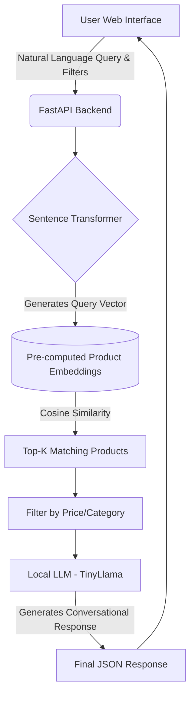

# Table of Contents
1. [Title and Abstract](#11-title-and-abstract)
2. [Keywords](#12-keywords)
3. [Introduction](#13-introduction)
4. [Objectives](#14-objectives)
5. [Research Gaps](#15-research-gaps)
6. [Proposed Solution](#16-proposed-solution)
   6.1 [Project Purpose and Scope](#61-project-purpose-and-scope)
   6.2 [Major Supported Operations](#62-major-supported-operations)
   6.3 [Input and Output Data](#63-input-and-output-data)
   6.4 [Implementation Language and Platform](#64-implementation-language-and-platform)
   6.5 [System Architecture Diagram](#65-system-architecture-diagram)
7. [Validation and Evaluation](#7-validation-and-evaluation)

---

## 1.1 Title and Abstract
**Title:** Conversational User Interfaces for RS: An LLM-based Semantic Search Recommendation System for E-Commerce

**Abstract:** 
Traditional e-commerce platforms primarily rely on exact keyword matching and collaborative filtering, which often fail to capture the nuanced, natural language intent of users. This project proposes a conversational recommender system (RS) that leverages Large Language Models (LLMs) and deep semantic search to enhance product discovery. Utilizing a cleaned dataset of Amazon products, the system generates dense vector embeddings of product metadata using Sentence Transformers (`all-MiniLM-L6-v2`). When a user inputs a natural language query (e.g., "gaming laptop with fast graphics"), the system retrieves the Top-K most semantically relevant products using cosine similarity, augmented by hard filters like maximum price and category. Finally, a local LLM (TinyLlama) generates a personalized, conversational response explaining the recommendations. The project is implemented via a modern web interface and evaluated rigorously using Precision@5, Recall@5, and F1-score metrics.

## 1.2 Keywords
Recommender Systems, Conversational User Interfaces, Large Language Models (LLM), Semantic Search, Natural Language Processing (NLP), E-Commerce, Sentence Transformers.

## 1.3 Introduction
The landscape of Recommender Systems (RS) is rapidly evolving from static, grid-based displays of products to dynamic, conversational interfaces. Users increasingly expect search engines to understand complex natural language queries rather than rigid keywords. While existing solutions like collaborative filtering work well for general recommendations, they struggle with "cold-start" problems and highly specific user intents. By integrating Generative AI and deep semantic embeddings, this project introduces a recommender system that not only finds highly relevant products but also communicates with the user naturally, providing context-specific explanations for its suggestions.

## 1.4 Objectives
1. **Develop a Semantic Search Engine:** To implement a robust vector-based recommendation engine using Sentence Transformers that accurately matches user intent with product descriptions.
2. **Integrate Conversational UI:** To utilize a local Large Language Model (TinyLlama) to generate natural, user-centric explanations for the retrieved recommendations.
3. **Build an Interactive Platform:** To design and deploy a responsive, intuitive web interface (GUI) that allows users to seamlessly interact with the conversational agent and apply dynamic filters (price, rating, category).
4. **Rigorous System Evaluation:** To validate and evaluate the recommendation logic using established information retrieval metrics, specifically Precision@K, Recall@K, and F1-score.

## 1.5 Research Gaps
1. **Lack of Intent Understanding:** Traditional keyword-based systems struggle to understand semantic meaning (e.g., matching "healthy drink" to "green tea"), resulting in poor search relevance for descriptive queries.
2. **Absence of Explainability:** Conventional recommender systems present items without explaining *why* they fit the user's needs, leading to lower user trust.
3. **Static User Interaction:** Most e-commerce platforms lack user-adaptive, conversational interactions that mimic the experience of talking to a human sales assistant.

## 1.6 Proposed Solution

### 6.1 Project Purpose and Scope
The purpose of this project is to build an end-to-end, LLM-powered conversational recommender system. The scope encompasses the backend data pipeline (cleaning and embedding the Amazon products dataset), the semantic retrieval engine, the LLM integration for conversational responses, and the frontend web GUI. The system focuses on the retail domain, providing tailored Amazon product recommendations.

### 6.2 Major Supported Operations
*   **Semantic Product Retrieval:** Converts natural language queries into vector embeddings to find the closest matching products via Cosine Similarity.
*   **Dynamic Filtering:** Allows users to narrow down recommendations using metadata filters (Maximum Price, Minimum Rating, Category).
*   **Conversational Generation:** Generates real-time, context-aware conversational text explaining the retrieved products to the user.
*   **System Evaluation:** An automated evaluation pipeline to calculate Average Precision@5, Recall@5, and F1-Scores across a diverse set of test queries.

### 6.3 Input and Output Data
*   **Input Data:** 
    *   *System Input:* The `amazon_products_cleaned.csv` dataset containing product names, categories, prices, ratings, and image URLs.
    *   *User Input:* Natural language queries (e.g., "waterproof bluetooth speaker"), category selections, and numeric filter constraints (price, rating).
*   **Output Data:** 
    *   Top-K recommended product objects (including titles, formatted prices, and images).
    *   A natural language string generated by the LLM summarizing the recommendations.

### 6.4 Implementation Language and Platform
*   **Backend / Recommendation Engine:** Python 3.11, FastAPI (for the RESTful API), Pandas, NumPy, Scikit-learn (for cosine similarity).
*   **AI/ML Models:** `sentence-transformers` (`all-MiniLM-L6-v2`) for embeddings, HuggingFace `transformers`, and PyTorch running a local `TinyLlama` model.
*   **Frontend GUI:** HTML5, Vanilla JavaScript, and Tailwind CSS.
*   **Platform:** Windows/Cross-platform local deployment using Uvicorn.

### 6.5 System Architecture Diagram

## 7. Validation and Evaluation
The system's recommendation logic is validated and evaluated using an automated testing notebook (`eval.ipynb`). The evaluation measures the effectiveness of the semantic search against a ground-truth set of diverse queries.
*   **Metrics Used:** Precision@5, Recall@5, and F1-Score.
*   **Testing Methodology:** 20 distinct natural language queries (e.g., "ergonomic office chair", "skincare for glowing skin") are mapped to expected Amazon dataset categories. The system retrieves the top 5 results, and the metrics are calculated based on the relevance of the retrieved categories. 
*   **Results:** The system demonstrates strong semantic understanding, achieving high Average Precision and Recall by successfully linking abstract user queries to precise product categories without relying on keyword matching.
